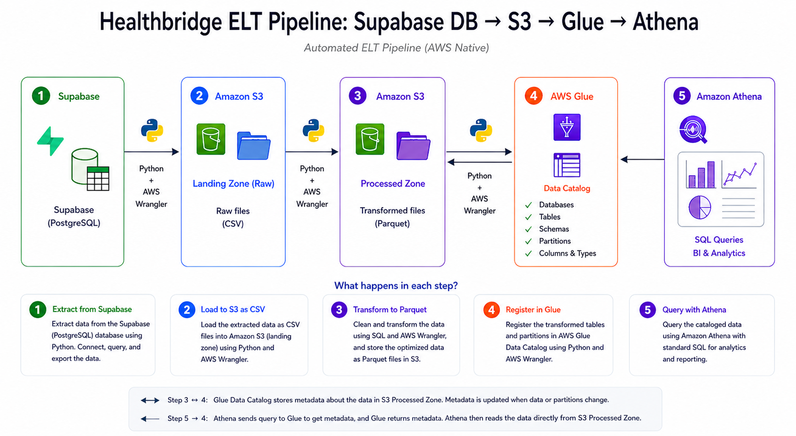
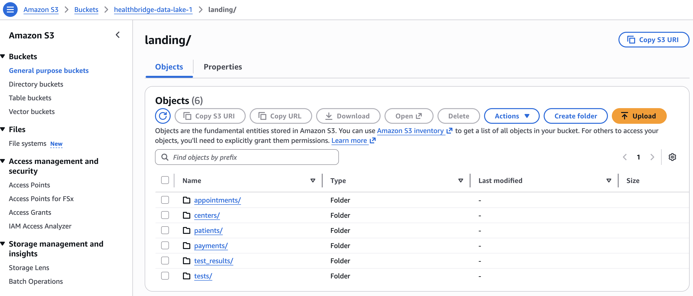
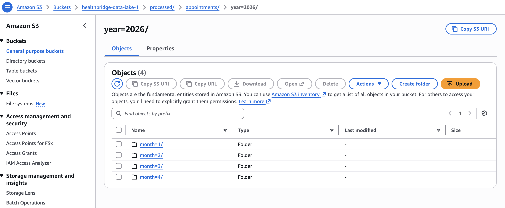
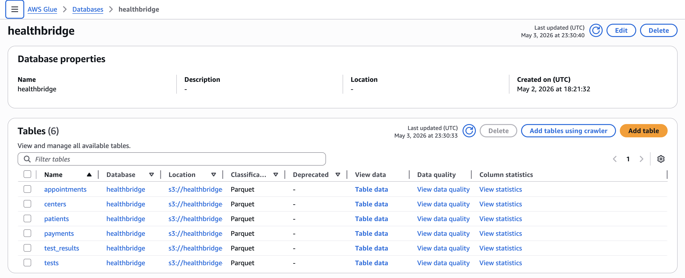
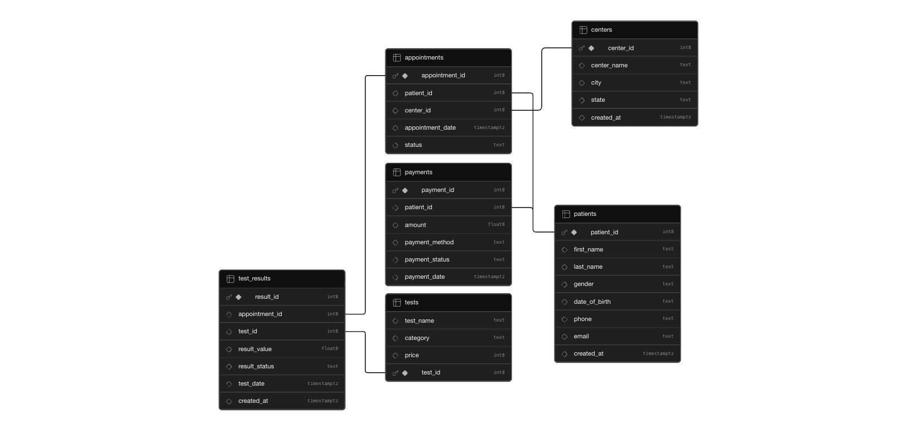
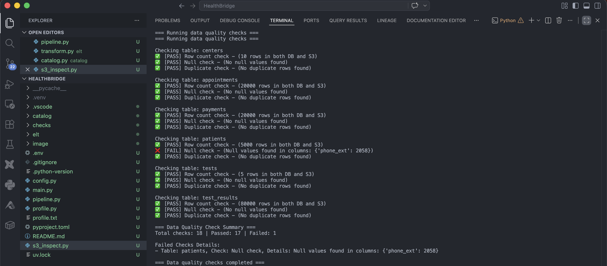
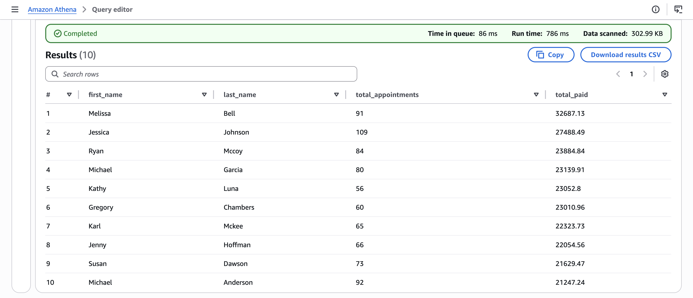
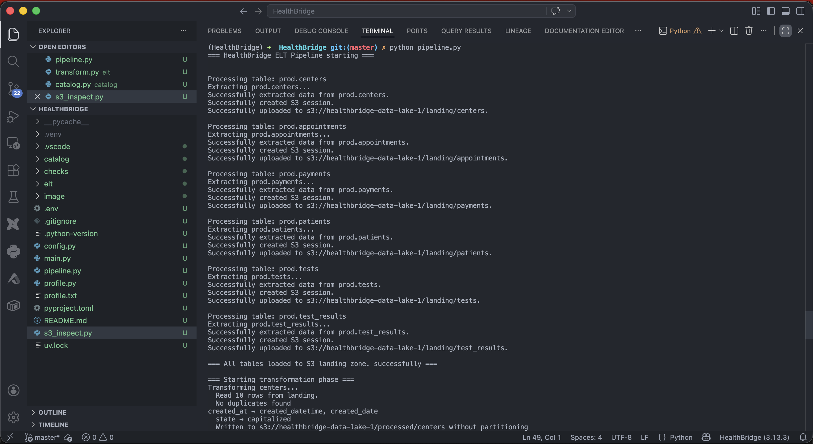

# HealthBridge Diagnostics — Cloud Data Migration Pipeline

> Migrating healthcare diagnostics data from on-premise PostgreSQL to AWS S3 and Athena using a production-grade ELT pipeline built in Python.



---

## Table of Contents

- [Business Context](#business-context)
- [The Challenge](#the-challenge)
- [Solution Architecture](#solution-architecture)
- [Tech Stack](#tech-stack)
- [Pipeline Overview](#pipeline-overview)
- [Project Structure](#project-structure)
- [Data Model](#data-model)
- [Key Transformations](#key-transformations)
- [Data Quality](#data-quality)
- [Results](#results)
- [Setup & Usage](#setup--usage)
- [Skills Demonstrated](#skills-demonstrated)

---

## Business Context

**HealthBridge Diagnostics Ltd.** is a fast-growing healthcare diagnostics provider operating across urban and semi-urban regions in West Africa. Founded in 2018, the company specialises in laboratory testing, diagnostic imaging, and digital health reporting across multiple diagnostic centres and a growing network of partner clinics.

HealthBridge processes thousands of patient records daily across five core operational domains:

| Domain | Description |
|--------|-------------|
| Patient Records | Personal information, medical history, diagnostic requests |
| Laboratory Results | Test outcomes across multiple diagnostic categories |
| Appointment Scheduling | Patient bookings and service timelines |
| Billing & Payments | Payment processing and insurance-related transactions |
| Centre Operations | Activity tracking across multiple lab locations |

---

## The Challenge

As HealthBridge scaled, its on-premise PostgreSQL database — the single source of truth for all operations — began creating friction across the business:

- **Restricted data access** — analysts and ML engineers had no safe access to production data, slowing down reporting and model development
- **Performance bottlenecks** — ad-hoc analytical queries competed directly with transactional workloads, degrading system performance
- **Rapid data growth** — growing patient volumes and multi-centre expansion strained on-premise storage and compute
- **Compliance and reporting needs** — regulatory requirements demanded reliable audit trails and historical data access

---

## Solution Architecture

To address these challenges, HealthBridge migrated to a cloud-based **ELT pipeline** on AWS — extracting raw data to a cloud landing zone, then transforming it into an analytics-ready format.

```
PostgreSQL (Supabase)
        │
        │  extract.py — SQLAlchemy + pandas
        ▼
S3 landing/                    ← raw CSV files, exact source copy
        │
        │  transform.py — pandas + awswrangler
        ▼
S3 processed/                  ← cleaned Parquet, partitioned by year/month
        │
        │  catalog.py — awswrangler + Glue API
        ▼
AWS Glue Catalog               ← schema registry, partition metadata
        │
        │  SQL queries
        ▼
AWS Athena                     ← serverless SQL analytics
```

This architecture delivers:

- **Scalability** — S3 and Athena scale infinitely without infrastructure management
- **Accessibility** — analysts query data with plain SQL, no database access required
- **Performance** — analytical workloads completely decoupled from transactional systems
- **Cost efficiency** — pay only for storage and queries actually run; Parquet + gzip reduces scan costs by ~21%
- **Analytics readiness** — partitioned, typed, schema-registered data queryable immediately

---

## Tech Stack

| Layer | Technology | Purpose |
|-------|-----------|---------|
| Source | PostgreSQL (Supabase) | On-premise operational database |
| Extraction | Python, SQLAlchemy, psycopg2 | Secure database connection and query execution |
| Data manipulation | pandas | In-memory data transformation |
| Cloud storage | AWS S3 | Raw landing zone and processed data lake |
| File format | Apache Parquet + gzip | Columnar, compressed, analytics-optimised storage |
| AWS integration | awswrangler | S3 reads/writes, Glue registration |
| Schema registry | AWS Glue | Table definitions, partition metadata |
| Query engine | AWS Athena | Serverless SQL on S3 |
| Credentials | python-dotenv | Secure credential management |
| Dependency management | uv | Fast Python package management |

---

## Pipeline Overview

The pipeline runs end-to-end from a single command:

```bash
python pipeline.py
```

It executes four sequential stages:

### Stage 1 — Extract
Connects to Supabase PostgreSQL and extracts all tables into pandas DataFrames using SQLAlchemy with SSL encryption.

```python
df = pd.read_sql(f"SELECT * FROM prod.{table}", engine)
```

### Stage 2 — Load (raw)
Streams each DataFrame directly to S3 as CSV using an in-memory buffer — no local files written to disk.

```
s3://healthbridge-data-lake-1/landing/
├── centers.csv
├── appointments.csv
├── payments.csv
├── patients.csv
├── tests.csv
└── test_results.csv
```



### Stage 3 — Transform
Reads raw CSVs from S3, applies cleaning transformations, and writes optimised Parquet files back to S3. Large tables are partitioned by year and month for efficient querying.

```
s3://healthbridge-data-lake-1/processed/
├── centers.parquet
├── patients.parquet
├── tests.parquet
├── appointments/
│   ├── year=2026/month=1/
│   ├── year=2026/month=2/
│   └── ...
├── payments/
│   └── year=2026/month=.../
└── test_results/
    └── year=2026/month=.../
```



### Stage 4 — Catalog & Quality
Registers all tables and partitions in AWS Glue, then runs automated data quality checks validating row counts, nulls, and duplicates across every table.



---

## Data Model

Six tables extracted from the `prod` schema:

| Table | Rows | Description |
|-------|------|-------------|
| `centers` | 10 | Diagnostic centre locations |
| `patients` | 5,000 | Patient demographics and contact info |
| `appointments` | 20,000 | Patient appointment bookings |
| `payments` | 20,000 | Payment transactions |
| `tests` | 5 | Available diagnostic test catalogue |
| `test_results` | 80,000 | Test outcomes per appointment |



---

## Key Transformations

All transformations are applied in `elt/transform.py` before writing to the processed zone:

### Datetime handling
Timestamp columns are split into two — a full datetime for precision and a date-only column for simple filtering:

```
appointment_date (str)  →  appointment_datetime (timestamp)
                        →  appointment_date (date only)
```

Athena queries never require casting:
```sql
WHERE appointment_date = '2026-02-06'   -- just works, no CAST needed
```

### Phone number standardisation
Patient phone numbers arrived in seven different formats from the source system. All are normalised to `XXX-XXX-XXXX` with extensions extracted to a separate column:

```
(773)807-7151x41699    →  phone: 773-807-7151   phone_ext: 41699
+1-527-209-3824x3862   →  phone: 527-209-3824   phone_ext: 3862
001-643-968-8759       →  phone: 643-968-8759   phone_ext: None
```

### Text standardisation
Status, gender, and location columns are title-cased for consistent reporting:
```
"completed" → "Completed"
"ILLINOIS"  → "Illinois"
"female"    → "Female"
```

### Compression
Files written using gzip compression, achieving **21% overall size reduction** vs the snappy default — directly reducing Athena scan costs:

| Table | Snappy | gzip | Saving |
|-------|--------|------|--------|
| appointments | 438 KB | 338 KB | 23% |
| payments | 554 KB | 426 KB | 23% |
| patients | 295 KB | 213 KB | 28% |
| test_results | 2,812 KB | 2,275 KB | 19% |
| **Total** | **4,108 KB** | **3,259 KB** | **21%** |

---

## Data Quality

Automated checks run after every pipeline execution, comparing source counts against S3 and validating data integrity:

```
✓ [PASS] Row count      — PostgreSQL=20000, S3=20000
✓ [PASS] Null check     — No nulls found
✓ [PASS] Duplicate check
```



Three checks per table on every run:

- **Row count validation** — PostgreSQL row count vs S3 Parquet row count must match exactly
- **Null checks** — all columns scanned for unexpected nulls
- **Duplicate checks** — full row deduplication check across each table

The pipeline logs failures but continues processing remaining tables — a single bad table never kills the entire run.

---

## Results

With the pipeline running, analysts query the full HealthBridge dataset directly in Athena using plain SQL — no database credentials, no performance impact on production systems.

```sql
SELECT
    p.first_name,
    p.last_name,
    COUNT(a.appointment_id)  AS total_appointments,
    SUM(pay.amount)          AS total_paid
FROM patients p
LEFT JOIN appointments a   ON p.patient_id = a.patient_id
LEFT JOIN payments pay     ON p.patient_id = pay.patient_id
GROUP BY p.first_name, p.last_name
ORDER BY total_paid DESC
LIMIT 10;
```



Full pipeline terminal output showing all stages completing successfully:



---

## Setup & Usage

### Prerequisites

- Python 3.10+
- uv package manager
- AWS account with S3, Glue, and Athena access
- Supabase PostgreSQL instance

### Installation

```bash
# Clone the repository
git clone https://github.com/yourusername/healthbridge-elt.git
cd healthbridge-elt

# Create virtual environment
uv venv
source .venv/bin/activate      # Mac/Linux
.venv\Scripts\activate         # Windows

# Install dependencies
uv add pandas sqlalchemy psycopg2-binary \
       awswrangler boto3 python-dotenv
```

### Configuration

Create a `.env` file at the project root — never commit this file:

```
# Database
user=your_db_user
password=your_db_password
host=your_supabase_host
port=5432
dbname=postgres

# AWS
AWS_ACCESS_KEY_ID=your_access_key
AWS_SECRET_ACCESS_KEY=your_secret_key
AWS_BUCKET_NAME=your-bucket-name
AWS_REGION=your-region
```

### Running the pipeline

```bash
# Full pipeline — extract, load, transform, catalog, checks
python pipeline.py

# Individual stages
python elt/extract.py
python elt/transform.py
python catalog/catalog.py
python checks/checks.py
```

### Adding a new table

1. Add the table to `TABLES` in `config.py`
2. Add datetime columns to `DATETIME_COLUMNS` in `transform.py`
3. Add capitalize columns to `CAPITALIZE_COLUMNS` in `transform.py`
4. Add schema definition to `TABLE_SCHEMAS` in `catalog/catalog.py`
5. Run `python pipeline.py`

---

## Project Structure

```
healthbridge/
├── .env                    ← credentials (never committed)
├── .gitignore
├── pipeline.py             ← orchestrator — run this
├── config.py               ← shared settings and variables
├── s3_inspect.py           ← S3 file size inspection utility
│
├── elt/
│   ├── __init__.py
│   ├── extract.py          ← Supabase → DataFrames
│   ├── load.py             ← DataFrames → S3 CSV
│   └── transform.py        ← CSV → cleaned Parquet
│
├── catalog/
│   ├── __init__.py
│   └── catalog.py          ← Glue schema registration
│
├── checks/
│   ├── __init__.py
│   └── checks.py           ← data quality validation
│
└── images/                 ← README screenshots
    ├── healthbridge_elt_architecture.png
    ├── supabase-schema.png
    ├── s3_landing.png
    ├── s3_partition.png
    ├── glue_tables.png
    ├── pipeline.png
    ├── check.png
    └── query2result.png
```

---

## Skills Demonstrated

**Python & data engineering**
- pandas for in-memory data transformation and cleaning
- SQLAlchemy and psycopg2 for secure PostgreSQL connectivity
- Regular expressions for complex phone number standardisation
- Modular pipeline design with clear separation of concerns
- Defensive error handling — per-table failures never kill the pipeline

**AWS cloud services**
- S3 two-zone architecture (landing/processed) following data lake best practices
- AWS Glue for programmatic schema registration and partition management
- Athena for serverless SQL analytics at scale
- IAM for least-privilege access management
- awswrangler for Pythonic AWS data engineering

**Data lake design**
- Two-stage ELT separating raw and processed zones
- Apache Parquet columnar format for analytical workloads
- gzip compression achieving 21% storage and cost reduction
- Year/month partitioning eliminating full table scans in Athena
- Schema-on-read via Glue catalog enabling SQL access without a database

**Data quality engineering**
- Automated row count reconciliation between source and destination
- Null and duplicate detection across all pipeline outputs
- Pass/fail reporting with full detail on failures

**Software engineering practices**
- Environment-based credential management — no secrets in code
- Configuration-driven design — new tables require one line change
- Single responsibility principle across all modules
- uv for fast, reproducible Python dependency management

---

*Data is synthetic and generated for demonstration purposes. No real patient data was used in this project.*